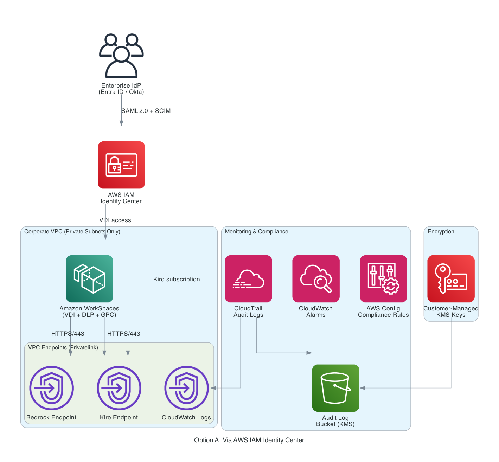
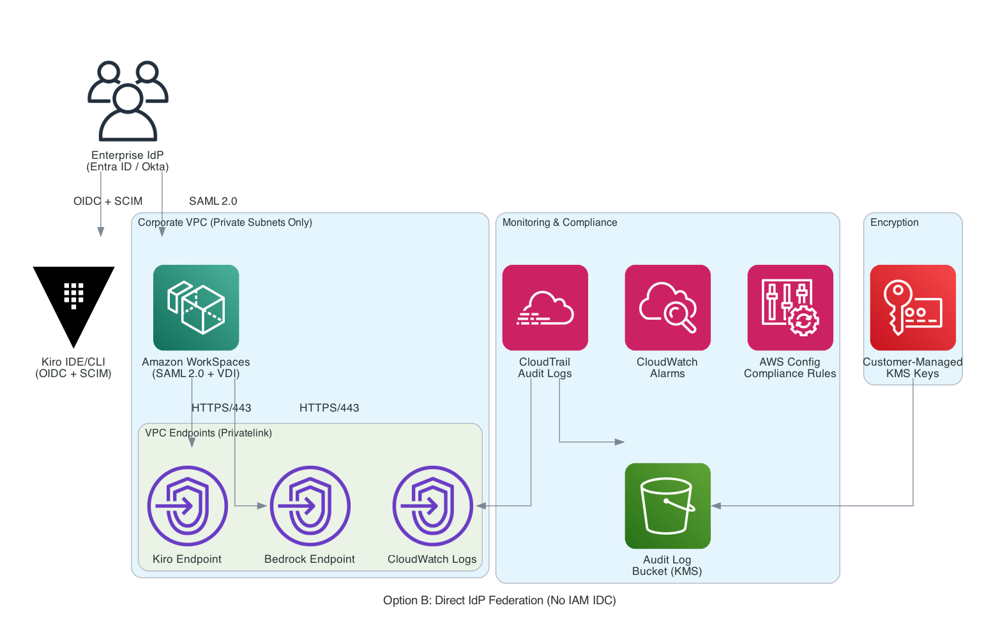
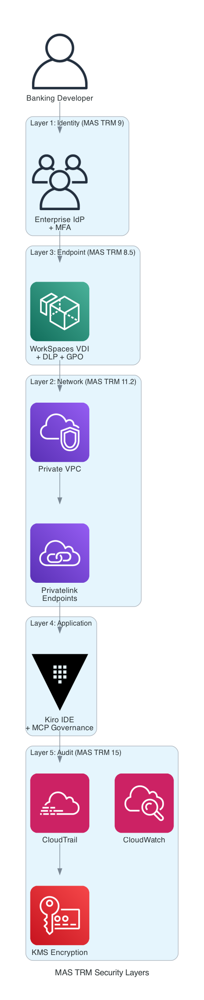

# AWS Kiro Banking Best Practices
## MAS-Compliant Implementation Guide for Singapore Financial Institutions

[](LICENSE)
[](https://www.mas.gov.sg/regulation/guidelines/technology-risk-management-guidelines)
[](https://kiro.dev)

> Security-first guidance for implementing AWS Kiro in banking SDLC environments while maintaining full compliance with Monetary Authority of Singapore (MAS) Technology Risk Management Guidelines.

---

## 📋 Table of Contents

- [Overview](#overview)
- [Key Features](#key-features)
- [Documentation Structure](#documentation-structure)
- [Quick Start](#quick-start)
- [Security Architecture](#security-architecture)
- [Compliance Framework](#compliance-framework)
- [Target Audience](#target-audience)
- [Contributing](#contributing)
- [License](#license)

---

## Overview

This repository provides comprehensive best practices for banking development teams implementing AWS Kiro (AI-powered development assistant) in Software Development Life Cycle (SDLC) environments. All guidance is designed to meet MAS regulatory requirements for financial institutions operating in Singapore.

### What is AWS Kiro?

AWS Kiro is an AI-powered IDE and development assistant that helps developers write, debug, and optimize code. For banking environments, special security controls are required to ensure compliance with financial services regulations.

### Why This Guide?

Financial institutions face unique challenges when adopting AI development tools:
- **Regulatory Compliance** - Must meet MAS Technology Risk Management Guidelines
- **Data Protection** - Sensitive code and data must remain within controlled environments
- **Access Control** - Enterprise identity management and MFA requirements
- **Audit Requirements** - Complete audit trails for all AI-assisted development activities
- **Network Security** - Private connectivity without internet exposure

This guide addresses all these challenges with practical, tested implementations.

---

## Key Features

### 🔐 Enterprise Security Controls
- Two architecture options: via AWS IAM Identity Center or direct IdP federation (Okta, Entra ID)
- SAML 2.0 / OIDC authentication with MFA enforcement
- SCIM provisioning for automated user and group synchronization
- Blocking of social logins and AWS Builder IDs
- Session management and timeout policies

### 🌐 Network Isolation
- End-to-end VPC architecture with no internet-facing endpoints
- AWS PrivateLink for private connectivity to Kiro services
- Security groups and Network ACLs for defense-in-depth
- DNS resolution within private network

### 🖥️ Secure Development Environment
- Amazon WorkSpaces VDI with encryption at rest and in transit
- Group Policy (GPO) hardening for Windows environments
- Data Loss Prevention (DLP) agent deployment
- Centralized MCP configuration management

### 🛡️ MCP Server Governance
- Whitelist-based MCP server approval process
- Centrally managed configuration preventing developer modifications
- Approved MCP servers for banking use cases
- Audit logging of all MCP tool usage

### 📊 Compliance & Audit
- CloudTrail logging for all Kiro activities
- CloudWatch monitoring and alerting
- Automated compliance validation scripts
- MAS TRM Guidelines mapping

---

## Documentation Structure

### Primary Documentation

| Document | Description | Status |
|----------|-------------|--------|
| **[README-Kiro-Banking-Best-Practices.md](README-Kiro-Banking-Best-Practices.md)** | Quick reference card with checklists | ✅ Complete |
| **[Kiro-Agentic-SDLC-Banking-Best-Practices.md](Kiro-Agentic-SDLC-Banking-Best-Practices.md)** | Comprehensive implementation guide (Sections 1-4) | ✅ Complete |
| **[Kiro-Banking-Best-Practices-Part2.md](Kiro-Banking-Best-Practices-Part2.md)** | Extended guidance (Sections 5-14) incl. PDPA, Outsourcing, AI/ML, ABS | ✅ Complete |
| **[Banking-Skills-Development-Guide.md](Banking-Skills-Development-Guide.md)** | How to build MAS-compliant Kiro Skills for banking | ✅ Complete |
| **[SECURITY.md](SECURITY.md)** | Security vulnerability reporting policy | ✅ Complete |

### Kiro Skills (Working Implementations)

| Skill | Description | MAS Reference |
|-------|-------------|---------------|
| **[.kiro/skills/mas-compliance-review/](.kiro/skills/mas-compliance-review/)** | Automated MAS TRM + PDPA compliance checking | TRM 9, 10, 11, 15 + PDPA |
| **[.kiro/skills/pii-detection/](.kiro/skills/pii-detection/)** | Singapore-specific PII detection and masking | PDPA + TRM 11.1 |
| **[.kiro/skills/banking-code-review/](.kiro/skills/banking-code-review/)** | Banking security code review with checklists | TRM 6, 9, 10, 11 + AIRG |

### Infrastructure as Code

| Document | Description |
|----------|-------------|
| **[cdk/](cdk/)** | AWS CDK (TypeScript) modules for MAS-compliant infrastructure |
| **[cdk/README.md](cdk/README.md)** | CDK deployment guide with architecture diagram |

### Steering Files (Sample Kiro Configuration)

| File | Description |
|------|-------------|
| **[.kiro/steering/banking-standards.md](.kiro/steering/banking-standards.md)** | Security requirements, prohibited patterns, data handling rules |
| **[.kiro/steering/fairness.md](.kiro/steering/fairness.md)** | MAS FEAT principles for bias prevention in financial logic |

### CI/CD Automation

| Workflow | Description |
|----------|-------------|
| **[.github/workflows/validate.yml](.github/workflows/validate.yml)** | Automated validation: docs, CDK synth/test, skill structure |

### Architecture Diagrams

| Diagram | Description |
|---------|-------------|
| **[diagrams/architecture-option-a.png](diagrams/architecture-option-a.png)** | Option A: Via IAM Identity Center |
| **[diagrams/architecture-option-b.png](diagrams/architecture-option-b.png)** | Option B: Direct IdP Federation |
| **[diagrams/security-layers.png](diagrams/security-layers.png)** | MAS TRM 5-layer security model |

### Technical Reference (Kiro Platform Docs)

Local snapshots of Kiro platform documentation for offline/air-gapped environments. See [kiro-docs/README.md](kiro-docs/README.md) for source URLs and freshness tracking.

| Document | Description |
|----------|-------------|
| **[kiro-docs/mcp-configuration.md](kiro-docs/mcp-configuration.md)** | MCP server configuration guide |
| **[kiro-docs/mcp-security.md](kiro-docs/mcp-security.md)** | MCP security best practices |
| **[kiro-docs/mcp-servers.md](kiro-docs/mcp-servers.md)** | Available MCP servers reference |
| **[kiro-docs/mcp-usage.md](kiro-docs/mcp-usage.md)** | MCP usage patterns and examples |
| **[kiro-docs/privacy-and-security.md](kiro-docs/privacy-and-security.md)** | Privacy and security guidelines |

### Regulatory Frameworks

- **MAS Framework for Impact and Risk Assessment of Financial Institutions.pdf**
- **TRM Guidelines 18 January 2021.pdf**
- **Risk Management Guidelines_Insurance Core Activities.pdf**
- **Monograph - A guide for senior executives - Final revised in April 2013.pdf**

---

## Quick Start

### Prerequisites

Before implementing Kiro in your banking environment, ensure you have:

- ✅ AWS Organization with IAM Identity Center enabled
- ✅ Enterprise IdP (Azure AD, Okta, Ping Identity) with SAML 2.0 support
- ✅ Corporate VPC with private subnets configured
- ✅ Amazon WorkSpaces directory set up
- ✅ DLP solution deployed (Symantec, McAfee, Microsoft Purview, or Forcepoint)
- ✅ CloudTrail enabled for audit logging

### Implementation Timeline

```
Week 1-2: Identity & Access Management
  └─ Configure Enterprise IdP integration with IAM Identity Center
  └─ Enable SCIM provisioning for user synchronization
  └─ Assign Kiro subscriptions to developer groups
  └─ Block social login URLs at firewall level

Week 2-3: Network Security Architecture
  └─ Create VPC Interface Endpoints for Kiro services
  └─ Configure security groups and Network ACLs
  └─ Enable Private DNS resolution
  └─ Test connectivity from WorkSpaces

Week 3-4: VDI Deployment
  └─ Deploy Amazon WorkSpaces with encryption
  └─ Apply Group Policy hardening
  └─ Install and configure DLP agents
  └─ Deploy centralized MCP configuration

Week 4-5: MCP Governance
  └─ Define approved MCP server whitelist
  └─ Create centralized mcp.json configuration
  └─ Implement file system permissions
  └─ Test developer access restrictions

Week 5-6: Monitoring & Compliance
  └─ Enable CloudTrail logging for Kiro activities
  └─ Configure CloudWatch alarms
  └─ Implement compliance validation scripts
  └─ Conduct security audit and documentation review
```

### Getting Started

1. **Read the Overview**
   ```bash
   # Start with the comprehensive overview
   open README-Kiro-Banking-Best-Practices.md
   ```

2. **Review Architecture**
   ```bash
   # Understand the security architecture
   open Kiro-Agentic-SDLC-Banking-Best-Practices.md
   ```

3. **Configure Your Environment**
   ```bash
   # Follow the step-by-step implementation guide
   # Begin with Section 2: Authentication & Identity Management
   ```

4. **Validate Compliance**
   ```bash
   # Use the provided validation scripts
   ./validate-repo.sh
   ```

---

## Security Architecture

This guide supports two architecture options depending on your organization's identity management strategy.

### Option A: Via AWS IAM Identity Center (Default)

Enterprise IdP federates through IAM Identity Center, which centrally manages access to both Kiro subscriptions and WorkSpaces. This is the traditional approach and provides unified access management across all AWS services.



### Option B: Direct IdP Federation (No IAM Identity Center)

Since [Kiro v0.9.40](https://kiro.dev/changelog/ide/external-identity-provider-support-for-kiro-ide/), enterprise teams can connect **Okta** or **Microsoft Entra ID** directly to Kiro without IAM Identity Center. Amazon WorkSpaces also supports [direct SAML 2.0 federation](https://docs.aws.amazon.com/workspaces/latest/adminguide/amazon-workspaces-saml.html) with external IdPs when using AWS Directory Service directories.

This option removes IAM Identity Center entirely, simplifying the architecture for organizations that prefer direct IdP integration.



**Option B Requirements:**
- Kiro: Create OIDC + SAML apps in your IdP, configure SCIM provisioning, verify company domain via DNS ([Okta setup](https://kiro.dev/docs/enterprise/identity-provider/okta/))
- WorkSpaces: AWS Directory Service (Managed AD, Simple AD, or AD Connector) with SAML 2.0 configured for your IdP
- MFA enforcement handled directly by the IdP (not IAM Identity Center)

**When to choose Option B:**
- Your organization already uses Okta or Entra ID as the primary identity platform
- You want fewer AWS service dependencies in the authentication chain
- You prefer a single IdP configuration that works across both Kiro IDE and CLI

### Security Layers

Both architectures share the same 5-layer security model:



1. **Identity Layer** - Enterprise IdP + MFA (via IAM Identity Center or direct federation)
2. **Network Layer** - VPC + PrivateLink + Security Groups
3. **Endpoint Layer** - WorkSpaces VDI + DLP + GPO
4. **Application Layer** - MCP Governance + Centralized Configuration
5. **Audit Layer** - CloudTrail + CloudWatch + Compliance Validation

---

## Compliance Framework

### Regulatory Framework Coverage

| Regulation | Scope | Document Reference |
|------------|-------|-------------------|
| **MAS TRM Guidelines** (Jan 2021) | Technology risk management (15 sections) | Part 1 & Part 2 |
| **Singapore PDPA** (2012, amended 2020) | Personal data protection | Part 2, Section 11 |
| **MAS Outsourcing Guidelines** (2018) | Third-party service risk management | Part 2, Section 12 |
| **MAS FEAT Principles** | AI/ML fairness, ethics, accountability, transparency | Part 2, Section 13 |
| **ABS Cloud Computing Guide** | Industry cloud security standards | Part 2, Section 14 |
| **ABS Penetration Testing Guidelines** | Security assessment standards | Part 2, Section 14.2 |

### MAS TRM Guidelines Mapping

| MAS Section | Control Area | Implementation | Document Reference |
|-------------|--------------|----------------|-------------------|
| **3.1** | Governance & Oversight | IAM IDC + Enterprise IdP | Section 2 |
| **5.1-5.2** | IT Project Mgmt & Security-by-Design | Supervised mode + Skills | Section 6 |
| **9.1** | Access Control | MFA + Session Management | Section 2.1.3 |
| **9.3** | Remote Access Security | VPC + PrivateLink | Section 3 |
| **10** | Cryptography | TLS 1.2+ + KMS | Section 7 |
| **11.1** | Data Security | DLP + Encryption + PDPA | Section 4.1.3, Section 11 |
| **11.2** | Network Security | VPC Endpoints + Security Groups | Section 3.2 |
| **12.1-12.3** | Cyber Security Operations | CloudWatch + monitoring | Section 8 |
| **13.1-13.4** | Security Assessment | Annual VA/PT of Kiro environments | Section 14.2 |
| **15** | IT Audit | CloudTrail + Monitoring | Section 8 |

### Key Compliance Controls

✅ **Zero Trust Architecture** - No internet-facing endpoints, all traffic through VPC PrivateLink
✅ **MFA Enforcement** - Required for all user access via Enterprise IdP
✅ **Least Privilege** - IAM policies grant minimum required permissions
✅ **Encryption** - Data encrypted at rest (KMS) and in transit (TLS 1.2+)
✅ **Audit Trails** - CloudTrail logging with 90-day minimum retention
✅ **Data Residency** - All data processing within Singapore region (ap-southeast-1)
✅ **DLP Controls** - Prevent code exfiltration and credential exposure
✅ **MCP Governance** - Centrally managed whitelist, no developer modifications
✅ **PDPA Compliance** - Data classification, DLP rules for personal data, breach notification
✅ **AI Governance** - FEAT principles applied, human accountability for AI-generated code
✅ **Outsourcing Risk** - Due diligence, exit strategy, concentration risk management  

---

## Target Audience

This documentation is designed for:

- **Banking Developers** - Implementing Kiro in daily SDLC workflows
- **Security Architects** - Designing secure AI development environments
- **Compliance Officers** - Validating MAS regulatory compliance
- **Cloud Operations Teams** - Deploying and managing Kiro infrastructure
- **Development Team Leads** - Establishing secure development practices
- **IT Auditors** - Reviewing security controls and audit trails

---

## Contributing

We welcome contributions from the banking and financial services community. Please see [CONTRIBUTING.md](CONTRIBUTING.md) for guidelines on:

- Submitting security enhancements
- Reporting compliance gaps
- Sharing implementation experiences
- Proposing new MCP server approvals
- Improving documentation

---

## License

This documentation is licensed under the MIT License. See [LICENSE](LICENSE) for full details.

### Disclaimer

This documentation is provided for informational and educational purposes only. It does not constitute legal advice, regulatory guidance, or professional security consulting services. Organizations must:

- Conduct independent security assessments and risk analysis
- Consult with qualified legal, compliance, and security professionals
- Validate implementations against specific regulatory requirements
- Maintain full responsibility for security posture and compliance status

---

## Approved MCP Servers for Banking

### Tier 1: Pre-Approved (No Additional Review)
- **AWS Documentation** - Official AWS docs access
- **Git** - Repository operations (read-only recommended)
- **Filesystem** - Controlled directory access

### Tier 2: Conditional Approval (Security Review Required)
- **GitHub** - With token scope restrictions
- **Docker** - For containerized builds
- **Kubernetes** - For deployment automation

### Tier 3: Prohibited
- **Web Search** - External data leakage risk
- **Browser** - Uncontrolled web access
- **Custom/Unverified** - Unknown security posture

---

## Additional Resources

### AWS Documentation
- [Kiro Privacy and Security](https://kiro.dev/docs/privacy-and-security/)
- [Kiro MCP Security](https://kiro.dev/docs/mcp/security/)
- [Kiro MCP Configuration](https://kiro.dev/docs/mcp/configuration/)
- [Kiro External IdP Support (Okta)](https://kiro.dev/docs/enterprise/identity-provider/okta/)
- [Kiro External IdP Changelog](https://kiro.dev/changelog/ide/external-identity-provider-support-for-kiro-ide/)
- [AWS IAM Identity Center](https://docs.aws.amazon.com/singlesignon/)
- [Amazon WorkSpaces SAML 2.0 Authentication](https://docs.aws.amazon.com/workspaces/latest/adminguide/amazon-workspaces-saml.html)
- [AWS PrivateLink](https://docs.aws.amazon.com/vpc/latest/privatelink/)
- [Amazon WorkSpaces](https://docs.aws.amazon.com/workspaces/)

### MAS Guidelines
- [Technology Risk Management Guidelines (Jan 2021)](https://www.mas.gov.sg/regulation/guidelines/technology-risk-management-guidelines)
- [MAS Framework for Impact and Risk Assessment](https://www.mas.gov.sg/)
- [MAS Guidelines on Outsourcing](https://www.mas.gov.sg/regulation/guidelines/guidelines-on-outsourcing)
- [MAS FEAT Principles (AI/ML)](https://www.mas.gov.sg/publications/monographs-or-information-paper/2018/feat)

### Singapore Data Protection
- [Personal Data Protection Act (PDPA)](https://www.pdpc.gov.sg/overview-of-pdpa/the-legislation/personal-data-protection-act)

### Industry Standards
- [ABS Cloud Computing Implementation Guide](https://abs.org.sg/)
- [ABS Penetration Testing Guidelines](https://abs.org.sg/)

### AWS Compliance
- [AWS Financial Services Security](https://aws.amazon.com/financial-services/security-compliance/)
- [AWS Compliance Programs](https://aws.amazon.com/compliance/)

---

## Support

For questions, issues, or feedback:

- **Documentation Issues**: Open an issue in this repository
- **Security Concerns**: Follow responsible disclosure practices
- **Implementation Support**: Consult with AWS Professional Services or AWS Partners

---

## Version History

| Version | Date | Changes |
|---------|------|---------|
| 1.0 | 2026-02-25 | Initial release (Sections 1-4) |
| 1.1 | 2026-02-26 | Complete sections 5-10, add README |
| 1.2 | 2026-02-28 | Regulatory enhancement: PDPA, Outsourcing, AI/ML, ABS guidelines |
| 1.3 | 2026-02-28 | AWS CDK infrastructure modules (4 stacks) |
| 1.4 | 2026-02-28 | Working Kiro Skills (3 skills) + GitHub Actions CI/CD |
| 1.5 | 2026-03-11 | Add Option B: Direct IdP federation architecture (no IAM IDC), fix CDK compilation and tests |
| 1.6 | 2026-03-11 | Architecture diagrams (PNG), SECURITY.md, steering samples, README consolidation, kiro-docs tracking |

---

**Version:** 1.6
**Last Updated:** March 11, 2026
**Maintained By:** Security Architecture Team
