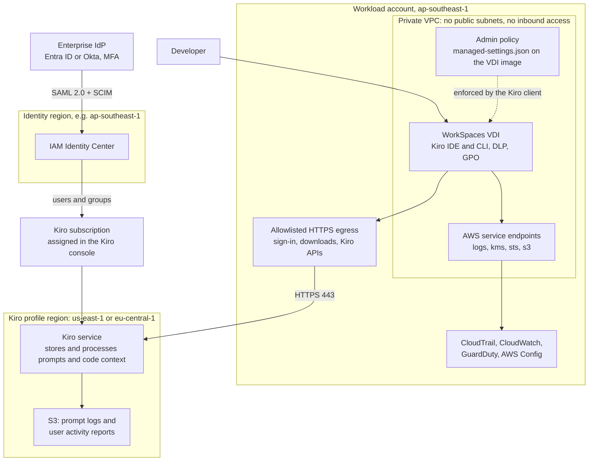
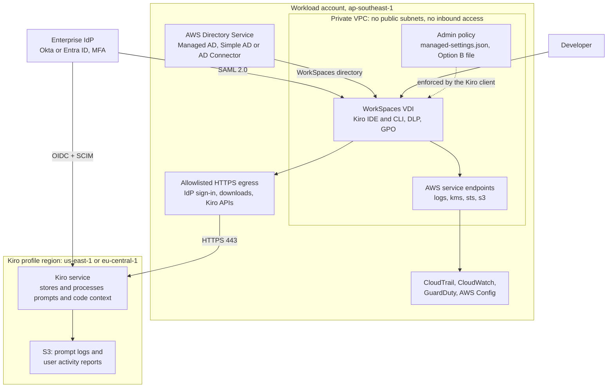
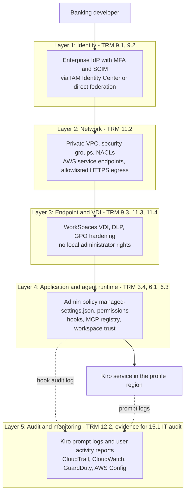

# AWS Kiro in FSI Best Practices
## MAS-Aligned Implementation Guide for Singapore Financial Institutions

[](LICENSE)
[](https://www.mas.gov.sg/regulation/guidelines/technology-risk-management-guidelines)
[](https://kiro.dev)

> **Renamed:** this repository was renamed from `kiro-banking-best-practices` to `kiro-fsi-best-practices` (October 2026). Old links and clones redirect automatically. The banking reference implementation, file names and CDK resource names are unchanged.

> Security-first guidance for implementing AWS Kiro in SDLC environments, designed to support alignment with the Monetary Authority of Singapore (MAS) Technology Risk Management Guidelines. Each institution remains responsible for its own compliance assessment.

---

## 📋 Table of Contents

- [Overview](#overview)
- [Start Here](#start-here)
- [Key Features](#key-features)
- [Documentation Structure](#documentation-structure)
- [Quick Start](#quick-start)
- [Security Architecture](#security-architecture)
- [Compliance Framework](#compliance-framework)
- [Target Audience](#target-audience)
- [Contributing](#contributing)
- [License](#license)

---

## Overview

This repository provides comprehensive best practices for FSI development teams implementing AWS Kiro (AI-powered development assistant) in Software Development Life Cycle (SDLC) environments. All guidance is designed to support alignment with MAS regulatory requirements for financial institutions operating in Singapore; each institution remains responsible for its own compliance assessment.

### What is AWS Kiro?

AWS Kiro is an AI-powered IDE and development assistant that helps developers write, debug, and optimize code. For FSI environments, special security controls are needed to support compliance with financial services regulations.

### Why This Guide?

Financial institutions face unique challenges when adopting AI development tools:
- **Regulatory Alignment** - Must align with the MAS Technology Risk Management Guidelines and comply with binding MAS Notices (for banks, Notices FSM-N05 and FSM-N06)
- **Data Protection** - Sensitive code and data must remain within controlled environments
- **Access Control** - Enterprise identity management and MFA requirements
- **Audit Requirements** - Complete audit trails for all AI-assisted development activities
- **Network Security** - No inbound internet exposure and tightly controlled, allowlisted outbound connectivity

This guide addresses these challenges with practical reference implementations (validated by unit tests, cdk-nag, synth and an integration test in a sandbox AWS account; not a substitute for your own testing).

---

## Start Here

New here? Use the map below to jump straight to what you need. **AI agents:** see [`AGENTS.md`](AGENTS.md) for the machine-oriented version (auto-loaded by Kiro's default agent).

| I want to… | Go to |
|------------|-------|
| Get running in ~15 minutes (Kiro CLI) | [Quick Start → First 15 minutes](#quick-start) |
| Deploy the admin policy (deny/ask permission rules, sign-in restriction) — **client-enforced** | [`managed-settings/README.md`](managed-settings/README.md) |
| Understand the Layer 4 governance model (admin policy, console settings, workspace trust, permissions, hooks, audit) | [`kiro-docs/agent-runtime-governance.md`](kiro-docs/agent-runtime-governance.md) |
| Look up permission rules, precedence and Kiro's hardcoded invariants | [`kiro-docs/permissions-and-managed-settings.md`](kiro-docs/permissions-and-managed-settings.md) |
| Apply Kiro console governance (models, MCP registry, web tools, API keys, Cloud Sessions) and choose approved models | [`kiro-docs/security-governance-features.md`](kiro-docs/security-governance-features.md) |
| Restrict MCP servers (registry with pinned versions, workspace trust) | [Part 2, Section 5](Kiro-Banking-Best-Practices-Part2.md) and [`kiro-docs/mcp-security.md`](kiro-docs/mcp-security.md) |
| Set up auth, network & VDI (Sections 1–4) | [`Kiro-Agentic-SDLC-Banking-Best-Practices.md`](Kiro-Agentic-SDLC-Banking-Best-Practices.md) |
| Go deeper: MCP, SDLC, PDPA, FEAT (Sections 5–14) | [`Kiro-Banking-Best-Practices-Part2.md`](Kiro-Banking-Best-Practices-Part2.md) |
| Build a MAS-aligned Kiro Skill | [`Banking-Skills-Development-Guide.md`](Banking-Skills-Development-Guide.md) |
| Install the defense-in-depth hooks and the reference agent | [`agent-hooks/README.md`](agent-hooks/README.md) |
| Deploy the AWS infrastructure | [`cdk/`](cdk/) |
| Check MAS TRM coverage | [Compliance Framework](#compliance-framework) |

> **What Kiro enforces:** the admin rules and sign-in restriction in `managed-settings.json` ([`managed-settings/`](managed-settings/)), the Kiro console settings (model allow list, MCP governance and registry, web tools, API keys, Cloud Sessions), workspace trust and Kiro's hardcoded invariants. User `permissions.yaml`, agent permissions and hooks are **defense in depth**. Everything under `.kiro/steering/` and `.kiro/skills/` is **guidance**, not an enforced boundary. All Kiro controls run on the developer's machine, so a user with local administrator rights can bypass them; the endpoint controls and server-side boundaries (branch protection, IAM, egress allowlist) keep them meaningful.

---

## Key Features

### 🔐 Enterprise Security Controls
- Two architecture options: via AWS IAM Identity Center or direct IdP federation (Okta, Entra ID)
- SAML 2.0 / OIDC authentication with MFA enforcement
- SCIM provisioning for automated user and group synchronization
- Blocking of social logins and AWS Builder IDs
- Session management and timeout policies

### 🌐 Network Isolation
- Private VPC for the WorkSpaces VDI in the workload region (`ap-southeast-1`): no public subnets and no inbound internet-facing endpoints
- Kiro is reached over HTTPS: AWS PrivateLink to Kiro is available only in the Kiro profile region (`us-east-1` or `eu-central-1`), and sign-in and downloads always use public HTTPS endpoints, which must be allowlisted. See [Part 1, Section 3](Kiro-Agentic-SDLC-Banking-Best-Practices.md#3-network-security-architecture) for the connectivity options
- Security groups and Network ACLs for defense-in-depth
- Outbound traffic restricted to an allowlist of Kiro, IAM Identity Center and IdP hostnames (central egress proxy or firewall)

### 🖥️ Secure Development Environment
- Amazon WorkSpaces VDI with encryption at rest and in transit
- Group Policy (GPO) hardening for Windows environments
- Data Loss Prevention (DLP) agent deployment
- Kiro admin policy (`managed-settings.json`) deployed by GPO or Intune to the official path, read-only for users

### 🛡️ MCP Server Governance
- Kiro MCP governance: MCP toggle and MCP Registry URL in the Kiro console; only servers listed in the registry load
- Registry entries pin exact versions (Kiro rejects version ranges; never use `latest`); clients re-fetch the registry at startup and every 24 hours
- Client-enforced for IAM Identity Center and API-key users in the IDE and CLI (not Kiro Web); MCP is disabled if the client cannot reach the governance API
- Workspace trust keeps the MCP configuration of unknown repositories from loading
- Approved MCP servers for banking use cases, each with a change record
- The registry controls which servers run, not what they connect to: the AWS Documentation server, for example, needs AWS documentation hosts on the egress allowlist, or use a remote endpoint instead
- MCP tools run on the client, so tool calls are recorded by a `PostToolUse` hook, not by CloudTrail

### 📊 Compliance & Audit
- Kiro prompt logging and user activity reports (S3 in the Kiro profile region), plus CloudTrail for AWS account activity
- CloudWatch monitoring and alerting
- Automated compliance validation scripts
- MAS TRM Guidelines mapping

### 🤖 Agent Runtime Governance (Layer 4)
- **Admin policy:** `managed-settings.json` deployed by MDM or GPO to the official path, with `deny` / `ask` permission rules (force pushes, history rewrites, destructive commands, credential reads, `git push` and deploy commands) and the sign-in restriction ([`managed-settings/`](managed-settings/))
- **Kiro console settings:** model allow list (experimental and preview models excluded by default), MCP governance with a version-pinned registry, web tools, API keys and Cloud Sessions off, prompt logging on
- **Workspace trust** for unknown repositories; user `permissions.yaml` and the reference agent's `permissions` are convenience layers that can never weaken an admin rule (deny wins)
- **Hooks** as defense in depth: secret/PII scanning of tool input, git and destructive-command guards, which block with exit code 2 ([`agent-hooks/README.md`](agent-hooks/README.md))
- **Audit:** Kiro prompt logging and user activity reports; the local hook audit log is supplementary, not tamper-proof
- These controls are enforced by the Kiro client: a user with local administrator rights can bypass them

### 🔒 Endpoint Enforcement (MDM) & Defense-in-Depth
- MDM or GPO deploys the managed files (`managed-settings.json`, global hooks) to Windows, macOS, Linux and VDI, keeps them read-only for standard users and reports drift
- Non-privileged developers and application allow-listing: without them, the client-side Kiro controls can be removed
- Authoritative boundaries are server-side: branch protection and CODEOWNERS, least-privilege IAM, the egress allowlist and subscription management

### 🧪 Adversarial Validation
- Chaos / penetration harness: a non-privileged user and the Kiro agent try to bypass the controls (for example with quoted or indirect shell commands that glob rules miss)
- Sanitized evidence in [`kiro-docs/chaos-pentest-evidence.md`](kiro-docs/chaos-pentest-evidence.md); re-run after each Kiro upgrade, because permission and hook behaviour changes between releases
- Integration test in a sandbox AWS account ([`security-tests/aws-integration/`](security-tests/aws-integration/README.md)): disposable SSM-only EC2 runners, a real deployment of all five CDK stacks, the root and SYSTEM MDM lockdowns, the full chaos harness, the `nat-dns-firewall` egress mode and the Kiro CLI behind the allowlist, then a verified teardown. Results in [`kiro-docs/aws-integration-test-evidence.md`](kiro-docs/aws-integration-test-evidence.md)

---

## Documentation Structure

### Primary Documentation

| Document | Description | Status |
|----------|-------------|--------|
| **[QUICK-REFERENCE.md](QUICK-REFERENCE.md)** | Quick reference card with checklists | ✅ Complete |
| **[Kiro-Agentic-SDLC-Banking-Best-Practices.md](Kiro-Agentic-SDLC-Banking-Best-Practices.md)** | Comprehensive implementation guide (Sections 1-4) | ✅ Complete |
| **[Kiro-Banking-Best-Practices-Part2.md](Kiro-Banking-Best-Practices-Part2.md)** | Extended guidance (Sections 5-14) incl. PDPA, Outsourcing, AI/ML, ABS | ✅ Complete |
| **[Banking-Skills-Development-Guide.md](Banking-Skills-Development-Guide.md)** | How to build MAS-aligned Kiro Skills for banking | ✅ Complete |
| **[managed-settings/](managed-settings/README.md)** | Admin policy (`managed-settings.json` for Option A and Option B), user `permissions.yaml` template and MCP registry example, with deployment and validation steps | ✅ Complete |
| **[agent-hooks/README.md](agent-hooks/README.md)** | Defense-in-depth hooks (secret/PII, git and destructive-command guards, audit) and the reference agent: installation, exit codes, tests | ✅ Complete |
| **[kiro-docs/agent-runtime-governance.md](kiro-docs/agent-runtime-governance.md)** | Layer 4 governance model: admin policy, console settings, workspace trust, permissions, hooks, audit | ✅ Complete |
| **[kiro-docs/mdm-endpoint-enforcement.md](kiro-docs/mdm-endpoint-enforcement.md)** | MDM deployment and drift detection for `managed-settings.json` and global hooks across Windows, macOS, Linux and VDI | ✅ Complete |
| **[kiro-docs/mdm-test-evidence.md](kiro-docs/mdm-test-evidence.md)** | Sanitized Windows/macOS/Linux lockdown test results | ✅ Complete |
| **[kiro-docs/chaos-pentest-evidence.md](kiro-docs/chaos-pentest-evidence.md)** | Chaos/pentest: non-privileged human + agent vs controls (findings + recommendations) | ✅ Complete |
| **[kiro-docs/aws-integration-test-evidence.md](kiro-docs/aws-integration-test-evidence.md)** | Sanitized results of the sandbox-account integration test: real CDK deployment, Linux/Windows MDM, chaos harness, DNS Firewall egress, Kiro CLI, teardown | ✅ Complete |
| **[SECURITY.md](SECURITY.md)** | Security vulnerability reporting policy | ✅ Complete |

### Kiro Skills (Reference Implementations)

| Skill | Description | MAS Reference |
|-------|-------------|---------------|
| **[.kiro/skills/mas-compliance-review/](.kiro/skills/mas-compliance-review/)** | Automated MAS TRM + PDPA compliance checking | TRM 9, 10, 11, 12.2 + PDPA |
| **[.kiro/skills/pii-detection/](.kiro/skills/pii-detection/)** | Singapore-specific PII detection and masking | PDPA + TRM 11.1 |
| **[.kiro/skills/banking-code-review/](.kiro/skills/banking-code-review/)** | Banking security code review with checklists | TRM 6.1, 9, 10, 11, 12.2 + MAS AI Risk Management Guidelines (2026) |

### Infrastructure as Code

| Document | Description |
|----------|-------------|
| **[cdk/](cdk/)** | AWS CDK (TypeScript) modules for MAS-aligned infrastructure |
| **[cdk/README.md](cdk/README.md)** | CDK deployment guide with architecture diagram |

### Steering Files (Sample Kiro Configuration)

| File | Description |
|------|-------------|
| **[.kiro/steering/banking-standards.md](.kiro/steering/banking-standards.md)** | Security requirements, prohibited patterns, data handling rules |
| **[.kiro/steering/fairness.md](.kiro/steering/fairness.md)** | MAS FEAT principles for bias prevention in financial logic |
| **[.kiro/steering/repo-map.md](.kiro/steering/repo-map.md)** | Repository navigation map for agents (always-included steering) |

### CI/CD Automation

| Workflow | Description |
|----------|-------------|
| **[.github/workflows/validate.yml](.github/workflows/validate.yml)** | Automated validation: docs, CDK synth/test, skill structure |

### Architecture Diagrams

The diagrams are Mermaid blocks in this README, so they render on GitHub and are kept in sync with the text.

| Diagram | Description |
|---------|-------------|
| **[Option A](#option-a-via-aws-iam-identity-center-default)** | Via IAM Identity Center |
| **[Option B](#option-b-direct-idp-federation-no-iam-identity-center)** | Direct IdP Federation |
| **[Security Layers](#security-layers)** | This guide's 5-layer security model |
| **[diagrams/generate_diagrams.py](diagrams/generate_diagrams.py)** | Optional PNG export of the same three diagrams (Python `diagrams` package + Graphviz) |

### Technical Reference (Kiro Platform Docs)

Local snapshots of Kiro platform documentation for offline/air-gapped environments. See [kiro-docs/README.md](kiro-docs/README.md) for source URLs and freshness tracking.

| Document | Description |
|----------|-------------|
| **[kiro-docs/mcp-configuration.md](kiro-docs/mcp-configuration.md)** | MCP server configuration guide |
| **[kiro-docs/mcp-security.md](kiro-docs/mcp-security.md)** | MCP security best practices |
| **[kiro-docs/mcp-servers.md](kiro-docs/mcp-servers.md)** | Available MCP servers reference |
| **[kiro-docs/mcp-usage.md](kiro-docs/mcp-usage.md)** | MCP usage patterns and examples |
| **[kiro-docs/privacy-and-security.md](kiro-docs/privacy-and-security.md)** | Privacy and security guidelines |
| **[kiro-docs/permissions-and-managed-settings.md](kiro-docs/permissions-and-managed-settings.md)** | Permissions (`permissions.yaml`), admin policy (`managed-settings.json`), sign-in controls, workspace trust, hooks and custom agents (Kiro 1.x) |
| **[kiro-docs/security-governance-features.md](kiro-docs/security-governance-features.md)** | Consolidated Kiro security & governance feature reference (CLI + IDE/General) with a model approval matrix, mapped to MAS TRM |
| **[kiro-docs/powers.md](kiro-docs/powers.md)** | Kiro Powers (dynamic MCP context loading) |
| **[kiro-docs/skills-cli.md](kiro-docs/skills-cli.md)** | Agent Skills in the Kiro CLI |
| **[kiro-docs/skills-ide.md](kiro-docs/skills-ide.md)** | Agent Skills in the Kiro IDE |
| **[kiro-docs/anthropic-skills-reference.md](kiro-docs/anthropic-skills-reference.md)** | Anthropic's public skills repository, as a reference implementation of the Agent Skills standard |

### Regulatory Frameworks

- **MAS Framework for Impact and Risk Assessment of Financial Institutions.pdf**
- **TRM Guidelines 18 January 2021.pdf**
- **Risk Management Guidelines_Insurance Core Activities.pdf**
- **Monograph - A guide for senior executives - Final revised in April 2013.pdf**
- **[MAS Notice FSM-N05](https://www.mas.gov.sg/regulation/notices/notice-fsm-n05) (Technology Risk Management) and [MAS Notice FSM-N06](https://www.mas.gov.sg/regulation/notices/notice-fsm-n06) (Cyber Hygiene)** — binding for banks from 10 May 2024 (replaced Notices 644 and 655); other sectors: see [Applicability](#applicability-across-mas-regulated-financial-institutions)
- **[MAS Notice 658](https://www.mas.gov.sg/regulation/notices/notice-658) + [Guidelines on Outsourcing (Banks)](https://www.mas.gov.sg/regulation/guidelines/guidelines-on-outsourcing-banks)** for banks, and **[Guidelines on Outsourcing (Financial Institutions other than Banks)](https://www.mas.gov.sg/regulation/guidelines/guidelines-on-outsourcing-financial-institutions-other-than-banks)** for other FIs — effective 11 Dec 2024; the earlier Guidelines on Outsourcing (2016, revised 2018) are cancelled
- **[MAS Guidelines on Artificial Intelligence Risk Management](https://www.mas.gov.sg/regulation/guidelines/guidelines-on-artificial-intelligence-risk-management-for-financial-institutions)** — published 7 Oct 2026, effective 7 Oct 2027

---

## Quick Start

### First 15 minutes (Kiro CLI)

Fast path for first-time users (full prerequisites are below).

```bash
# 1. Install Kiro CLI — see https://kiro.dev/docs/cli/

# 2. Clone and enter the repo
git clone https://github.com/timwukp/kiro-fsi-best-practices.git
cd kiro-fsi-best-practices

# 3. Validate the reference locked-down agent
kiro-cli agent validate --path agent-hooks/banking-secure.agent.json

# 4. Run the repo + hook checks
./validate-repo.sh                       # expect: RESULT: PASSED
bash agent-hooks/tests/run-tests.sh      # expect: FAIL=0
```

**Next:** deploy the admin policy from [`managed-settings/README.md`](managed-settings/README.md), install the hooks from [`agent-hooks/README.md`](agent-hooks/README.md), read [`kiro-docs/agent-runtime-governance.md`](kiro-docs/agent-runtime-governance.md) for how the layers fit together, then [Security Architecture](#security-architecture).

### Prerequisites

Before implementing Kiro in your banking environment, ensure you have:

- ✅ AWS Organization with IAM Identity Center enabled
- ✅ Enterprise IdP (Azure AD, Okta, Ping Identity) with SAML 2.0 support
- ✅ Corporate VPC with private subnets configured, plus an allowlisted HTTPS egress path for Kiro (see Part 1, Section 3)
- ✅ Amazon WorkSpaces directory set up
- ✅ DLP solution deployed (Symantec, McAfee, Microsoft Purview, or Forcepoint)
- ✅ CloudTrail enabled for audit logging

### Implementation plan

> **No fixed calendar.** Duration depends on your starting point and your organization's
> approval / identity / change processes — not on the technical work, which is small and
> largely automated. The estimates below are illustrative; validate them in your environment.

**Assumptions that drive duration:** existing AWS Organization + enterprise IdP;
identity-team availability for SCIM; security-team availability for MCP review; one starting
region/account; your change-management cadence.

| Workstream | Prerequisite | Technical effort* | Exit criterion (objective evidence) |
|------------|--------------|-------------------|-------------------------------------|
| Identity & access (IdP + SCIM + MFA) | IdP admin, IAM Identity Center | ~0.5–1 d | Test user auto-provisioned via SCIM; MFA enforced; social / Builder ID blocked |
| Network isolation (VPC endpoints, SG/NACL, egress allowlist) | VPC + subnets; egress path | ~0.5–1 d | `cdk synth` clean; VDI reaches Kiro only through the allowlisted egress path; no inbound public endpoint |
| Secure VDI (WorkSpaces + GPO/DLP) | Directory service | ~1–2 d | Encrypted WorkSpace launches; developers have no local admin rights; `managed-settings.json` is present, valid and read-only for users, and a test `git push --force` by the agent is denied with the source "administration" |
| MCP governance | approved-server list | ~0.5 d | MCP Registry URL set in the Kiro console; every entry pins an exact version; a server that is not in the registry stays hidden even when added to `mcp.json` |
| Agent runtime + endpoint enforcement | golden image | ~0.5–1 d | `agent-hooks/tests/run-tests.sh` + `mdm/tests/test-lockdown.sh` green; chaos harness = 0 unexpected bypass |
| Monitoring & compliance | CloudTrail / CloudWatch | ~0.5 d | Prompt logs and user activity reports arrive in S3 (profile region) and the SIEM; test alarm fires; MAS TRM mapping reviewed |

\* Hands-on time assuming the prerequisite already exists.

> **The long pole is organizational, not technical.** Hands-on effort totals only a few days;
> the calendar is set by IdP/SCIM coordination, MCP security reviews, and change approvals —
> **days to weeks**, depending on your organization. Measure progress by the **exit criteria
> above** (verifiable evidence), not by elapsed weeks.

### Getting Started

1. **Read the Overview**
   ```bash
   # Start with the comprehensive overview
   open QUICK-REFERENCE.md
   ```

2. **Review Architecture**
   ```bash
   # Understand the security architecture
   open Kiro-Agentic-SDLC-Banking-Best-Practices.md
   ```

3. **Configure Your Environment**
   ```bash
   # Follow the step-by-step implementation guide
   # Begin with Section 2: Authentication & Identity Management
   ```

4. **Validate Compliance**
   ```bash
   # Use the provided validation scripts
   ./validate-repo.sh
   ```

---

## Security Architecture

This guide supports two architecture options depending on your organization's identity management strategy.

### Option A: Via AWS IAM Identity Center (Default)

Enterprise IdP federates through IAM Identity Center, which centrally manages access to both Kiro subscriptions and WorkSpaces. This is the traditional approach and provides unified access management across all AWS services.


```mermaid
flowchart TB
    idp["Enterprise IdP<br>Entra ID or Okta, MFA"]
    dev["Developer"]
    subs["Kiro subscription<br>assigned in the Kiro console"]

    subgraph idreg["Identity region, e.g. ap-southeast-1"]
        idc["IAM Identity Center"]
    end

    subgraph wl["Workload account, ap-southeast-1"]
        subgraph vpc["Private VPC: no public subnets, no inbound access"]
            vdi["WorkSpaces VDI<br>Kiro IDE and CLI, DLP, GPO"]
            policy["Admin policy<br>managed-settings.json on the VDI image"]
            awsep["AWS service endpoints<br>logs, kms, sts, s3"]
        end
        egress["Allowlisted HTTPS egress<br>sign-in, downloads, Kiro APIs"]
        mon["CloudTrail, CloudWatch,<br>GuardDuty, AWS Config"]
    end

    subgraph prof["Kiro profile region: us-east-1 or eu-central-1"]
        kiro["Kiro service<br>stores and processes prompts and code context"]
        plogs["S3: prompt logs and<br>user activity reports"]
    end

    idp -->|"SAML 2.0 + SCIM"| idc
    idc -->|"users and groups"| subs
    subs --> kiro
    dev --> vdi
    policy -.->|"enforced by the Kiro client"| vdi
    vdi --> awsep
    awsep --> mon
    vdi --> egress
    egress -->|"HTTPS 443"| kiro
    kiro --> plogs
```

### Option B: Direct IdP Federation (No IAM Identity Center)

Since [Kiro v0.9.40](https://kiro.dev/changelog/ide/external-identity-provider-support-for-kiro-ide/), enterprise teams can connect **Okta** or **Microsoft Entra ID** directly to Kiro without IAM Identity Center. Amazon WorkSpaces also supports [direct SAML 2.0 federation](https://docs.aws.amazon.com/workspaces/latest/adminguide/amazon-workspaces-saml.html) with external IdPs when using AWS Directory Service directories.

This option removes IAM Identity Center entirely, simplifying the architecture for organizations that prefer direct IdP integration.


```mermaid
flowchart TB
    idp["Enterprise IdP<br>Okta or Entra ID, MFA"]
    dev["Developer"]

    subgraph wl["Workload account, ap-southeast-1"]
        ds["AWS Directory Service<br>Managed AD, Simple AD or AD Connector"]
        subgraph vpc["Private VPC: no public subnets, no inbound access"]
            vdi["WorkSpaces VDI<br>Kiro IDE and CLI, DLP, GPO"]
            policy["Admin policy<br>managed-settings.json, Option B file"]
            awsep["AWS service endpoints<br>logs, kms, sts, s3"]
        end
        egress["Allowlisted HTTPS egress<br>IdP sign-in, downloads, Kiro APIs"]
        mon["CloudTrail, CloudWatch,<br>GuardDuty, AWS Config"]
    end

    subgraph prof["Kiro profile region: us-east-1 or eu-central-1"]
        kiro["Kiro service<br>stores and processes prompts and code context"]
        plogs["S3: prompt logs and<br>user activity reports"]
    end

    idp -->|"OIDC + SCIM"| kiro
    idp -->|"SAML 2.0"| vdi
    ds -->|"WorkSpaces directory"| vdi
    dev --> vdi
    policy -.->|"enforced by the Kiro client"| vdi
    vdi --> awsep
    awsep --> mon
    vdi --> egress
    egress -->|"HTTPS 443"| kiro
    kiro --> plogs
```

**Option B Requirements:**
- Kiro: Create OIDC + SAML apps in your IdP, configure SCIM provisioning, verify company domain via DNS ([Okta setup](https://kiro.dev/docs/enterprise/identity-provider/okta/))
- WorkSpaces: AWS Directory Service (Managed AD, Simple AD, or AD Connector) with SAML 2.0 configured for your IdP
- MFA enforcement handled directly by the IdP (not IAM Identity Center)

**When to choose Option B:**
- Your organization already uses Okta or Entra ID as the primary identity platform
- You want fewer AWS service dependencies in the authentication chain
- You prefer a single IdP configuration that works across both Kiro IDE and CLI

### Security Layers

Both architectures share this guide's 5-layer security model. The layers are this guide's own structure, not a model defined by MAS; the TRM references show which MAS TRM Guidelines sections each layer supports.


```mermaid
flowchart TB
    dev["Banking developer"]

    subgraph layer1["Layer 1: Identity - TRM 9.1, 9.2"]
        l1["Enterprise IdP with MFA and SCIM<br>via IAM Identity Center or direct federation"]
    end

    subgraph layer2["Layer 2: Network - TRM 11.2"]
        l2["Private VPC, security groups, NACLs<br>AWS service endpoints, allowlisted HTTPS egress"]
    end

    subgraph layer3["Layer 3: Endpoint and VDI - TRM 9.3, 11.3, 11.4"]
        l3["WorkSpaces VDI, DLP, GPO hardening<br>no local administrator rights"]
    end

    subgraph layer4["Layer 4: Application and agent runtime - TRM 3.4, 6.1, 6.3"]
        l4["Admin policy managed-settings.json, permissions<br>hooks, MCP registry, workspace trust"]
    end

    subgraph layer5["Layer 5: Audit and monitoring - TRM 12.2, evidence for 15.1 IT audit"]
        l5["Kiro prompt logs and user activity reports<br>CloudTrail, CloudWatch, GuardDuty, AWS Config"]
    end

    kiro["Kiro service in the profile region"]

    dev --> l1
    l1 --> l2
    l2 --> l3
    l3 --> l4
    l4 --> kiro
    l4 -.->|"hook audit log"| l5
    kiro -.->|"prompt logs"| l5
```

> The diagrams above are Mermaid and render on GitHub. To export PNGs instead, run [`diagrams/generate_diagrams.py`](diagrams/generate_diagrams.py) (optional; needs the Python `diagrams` package and Graphviz).

1. **Identity Layer** (TRM 9.1, 9.2) - Enterprise IdP + MFA (via IAM Identity Center or direct federation)
2. **Network Layer** (TRM 11.2) - VPC + Security Groups + allowlisted egress (PrivateLink to Kiro only in the profile region)
3. **Endpoint Layer** (TRM 9.3, 11.3, 11.4) - WorkSpaces VDI + DLP + GPO
4. **Application Layer** (TRM 3.4, 6.1, 6.3) - Kiro admin policy (`managed-settings.json`) + Kiro console governance (models, MCP registry, web tools) + workspace trust + hooks ([Agent Runtime Governance](kiro-docs/agent-runtime-governance.md))
5. **Audit Layer** (TRM 12.2; evidence for 15.1 IT audit) - Kiro prompt logging + user activity reports + CloudTrail + CloudWatch + Compliance Validation (the local `PostToolUse` hook audit log is supplementary)

> **Where to configure Layer 4:** deploy the admin policy from [`managed-settings/README.md`](managed-settings/README.md), set the Kiro console settings described in [`kiro-docs/security-governance-features.md`](kiro-docs/security-governance-features.md), and add the hooks from [`agent-hooks/README.md`](agent-hooks/README.md). [`kiro-docs/agent-runtime-governance.md`](kiro-docs/agent-runtime-governance.md) explains how the layers fit together.

---

## Compliance Framework

### Regulatory Framework Coverage

| Regulation | Scope | Document Reference |
|------------|-------|-------------------|
| **MAS TRM Guidelines** (Jan 2021) | Technology risk management (15 sections); apply to all MAS-regulated FIs | Part 1 & Part 2 |
| **MAS Notice FSM-N05** (Technology Risk Management; banks; effective 10 May 2024) | Binding: unscheduled downtime of each critical system ≤ 4 hours in any 12 months and RTO ≤ 4 hours (paras 5–6); notify MAS within 1 hour of discovery of a relevant incident (para 7); root-cause and impact report within 14 days (para 8); protect customer information (para 9) | Part 2, Section 10 |
| **MAS Notice FSM-N06** (Cyber Hygiene; banks; effective 10 May 2024) | Binding: secure administrative accounts, security patching, written security standards, network perimeter controls, malware protection, MFA for administrative accounts on critical systems and for internet access to customer information | Part 1, Sections 2–4 |
| **Singapore PDPA** (2012, amended 2020) | Personal data protection | Part 2, Section 11 |
| **MAS Notice 658** + **Guidelines on Outsourcing (Banks)** for banks; **Guidelines on Outsourcing (FIs other than Banks)** for other FIs (all effective 11 Dec 2024) | Outsourcing and third-party service risk management; replace the cancelled 2016/2018 Guidelines on Outsourcing | Part 2, Section 12 |
| **MAS Guidelines on Artificial Intelligence Risk Management** (published 7 Oct 2026; effective 7 Oct 2027) | AI governance and life-cycle risk management for all AI, including generative AI and AI agents | Part 2, Section 13 |
| **MAS FEAT Principles** (2018) | Fairness, ethics, accountability, transparency in AI and data analytics (applied by analogy to AI-assisted development) | Part 2, Section 13 |
| **ABS Cloud Computing Guide** | Industry cloud security standards | Part 2, Section 14 |
| **ABS Penetration Testing Guidelines** | Security assessment standards | Part 2, Section 14.2 |

> **Proposed changes:** MAS [Consultation Paper P012-2026](https://www.mas.gov.sg/publications/consultations/2026/consultation-paper-on-proposed-amendments-to-notices-on-technology-risk-management) (10 Jun 2026; closed 31 Jul 2026) proposes amendments to the TRM notices (e.g. IT asset inventories covering open-source and third-party components, IT supply-chain and AI risk assessment, immutable or offline backups); the 1-hour, 14-day and 4-hour requirements are unchanged in the proposal.

### Applicability Across MAS-Regulated Financial Institutions

The MAS TRM Guidelines apply to all MAS-regulated financial institutions, including banks, insurers, insurance brokers, capital markets FIs, financial advisers, trust companies and payment institutions. The binding technology risk and cyber hygiene requirements sit in sector-specific notices:

| Sector | TRM notice | Cyber Hygiene notice |
|--------|------------|----------------------|
| Banks | FSM-N05 | FSM-N06 |
| Merchant banks | FSM-N11 | FSM-N12 |
| Insurers | FSM-N03 | FSM-N04 |
| Insurance brokers | FSM-N19 | FSM-N20 |
| Capital markets FIs | FSM-N21 | FSM-N22 |
| Licensed financial advisers | FSM-N23 | FSM-N24 |
| Designated payment systems and digital payment token service providers | FSM-N13 | FSM-N14 |
| Credit and charge card issuers | FSM-N07 | FSM-N08 |
| Finance companies | FSM-N09 | FSM-N10 |
| Trust companies | FSM-N25 | FSM-N26 |

- These notices replaced the earlier sector notices (e.g. Notices 644 and 655 for banks), which were cancelled with effect from 10 May 2024. Source: [MAS Cyber Security – Change of Notice References](https://www.mas.gov.sg/regulation/cyber-security).
- Only the text of FSM-N05 and FSM-N06 was verified verbatim for this guide; verify the wording of other sectors' notices before relying on them. Major and standard payment institutions are not covered by a TRM notice in this map, but the TRM Guidelines still apply.
- This guide's reference implementation is banking-focused (FSM-N05, FSM-N06, Notice 658). Other sectors should map the controls through their own notices and outsourcing guidelines.

### MAS TRM Guidelines Mapping

| MAS Section | Control Area | Implementation | Document Reference |
|-------------|--------------|----------------|-------------------|
| **3.4** | Management of Third Party Services | Kiro, MCP servers and model providers assessed as third-party services; outsourcing assessment (Notice 658 / Guidelines on Outsourcing) | Section 5, Section 12 |
| **5.4** | SDLC and Security-by-Design | Admin permission rules + Supervised autonomy; Skills and steering as guidance | Section 6 |
| **6.1, 6.3** | Secure Coding and Source Code Review; DevSecOps | Human review and testing of AI-generated and third-party code before integration (6.1.3), SAST/DAST (Annex A), segregation of duties and human approval before merge | Section 6 |
| **9.1** | User Access Management | IAM IDC + Enterprise IdP; MFA + Session Management | Section 2, Section 2.1.3 |
| **9.2** | Privileged Access Management | MFA for administrative access (banks: Notice FSM-N06 paras 4.1, 4.6) | Section 2.1.3 |
| **9.3** | Remote Access Management | WorkSpaces VDI in a private VPC with allowlisted egress | Section 3, Section 4 |
| **10.1, 10.2** | Cryptographic Algorithm and Protocol; Key Management | TLS 1.2+; KMS customer-managed keys with rotation | Section 7 |
| **11.1** | Data Security | DLP + Encryption + PDPA | Section 4.1.3, Section 11 |
| **11.2** | Network Security | VPC Endpoints + Security Groups + egress allowlist | Section 3.2 |
| **11.3, 11.4** | System Security; Virtualisation Security | Hardened WorkSpaces images + GPO | Section 4 |
| **12.2** | Cyber Event Monitoring and Detection | CloudTrail + CloudWatch monitoring | Section 8 |
| **12.3** | Cyber Incident Response and Management | Escalation matrix + MAS notification (banks: Notice FSM-N05 paras 7–8) | Section 10 |
| **13.1, 13.2, 13.4** | Vulnerability Assessment; Penetration Testing; Adversarial Attack Simulation | Annual VA/PT of Kiro environments; red-team exercises | Section 14.2, Section 14.3 |
| **15.1** | IT Audit | Independent IT audit uses the CloudTrail audit trail as evidence | Section 8 |

### Key Compliance Controls

- ✅ **Zero Trust Architecture** - No inbound internet-facing endpoints; Kiro traffic leaves only through an allowlisted HTTPS egress path. PrivateLink to Kiro exists only in the Kiro profile region, and sign-in and downloads use public HTTPS (see [Part 1, Section 3](Kiro-Agentic-SDLC-Banking-Best-Practices.md#3-network-security-architecture))
- ✅ **MFA Enforcement** - Required for all user access via Enterprise IdP (TRM 9.1–9.2; banks: Notice FSM-N06 para 4.6)
- ✅ **Least Privilege** - IAM policies grant minimum required permissions
- ✅ **Encryption** - Data encrypted at rest (KMS) and in transit (TLS 1.2+)
- ✅ **Audit Trails** - CloudTrail logging (TRM 12.2); 90-day minimum retention is an example institutional policy (not prescribed by MAS TRM)
- ✅ **Data Location Governance** - Identity can stay in Singapore (IAM Identity Center in ap-southeast-1), but Kiro stores and processes prompts, code context and responses in its profile region (us-east-1 or eu-central-1; there is no Singapore option) and may process them in other regions of the same geography; Global-scope models (currently GPT-5.6 Sol, Terra and Luna) may be processed in AWS Regions worldwide, while Geography-scope models, including all Claude models, stay within the geography. Prompt logs and user activity reports are stored in the profile region per AWS requirements. MAS TRM does not mandate data localisation — residency preferences are customer-driven. Treat Kiro use as a cross-border transfer (PDPA Transfer Limitation Obligation, s26; Part 2, Section 11), keep customer data out of prompts, and exclude Global-scope models with the model allow list. For organizations requiring regional log copies, S3 Cross-Region Replication (CRR) to ap-southeast-1 is available as a complementary control (Part 2, Section 7.2)
- ✅ **DLP Controls** - Prevent code exfiltration and credential exposure
- ✅ **MCP Governance** - Kiro MCP registry with exact pinned versions (client-enforced); unlisted servers stay hidden
- ✅ **PDPA Alignment** - Data classification, DLP rules for personal data, breach notification
- ✅ **AI Governance** - MAS AI Risk Management Guidelines (2026): assess Kiro's materiality (coding assistants are not among the basic-tier examples); FEAT principles applied by analogy; human accountability for AI-generated code
- ✅ **Outsourcing Risk** - Materiality assessment, due diligence, exit strategy, concentration risk management (TRM 3.4; Notice 658 and Guidelines on Outsourcing)
- ✅ **Incident Notification** - Escalation supports notifying MAS within 1 hour of discovery of a relevant incident and a root-cause report within 14 days (banks: Notice FSM-N05 paras 7–8)

---

## Target Audience

This documentation is designed for:

- **FSI Developers** - Banks, insurers, capital markets and payment institutions implementing Kiro in daily SDLC workflows (the reference implementation is banking-focused; see [Applicability Across MAS-Regulated Financial Institutions](#applicability-across-mas-regulated-financial-institutions))
- **Security Architects** - Designing secure AI development environments
- **Compliance Officers** - Assessing alignment with MAS requirements
- **Cloud Operations Teams** - Deploying and managing Kiro infrastructure
- **Development Team Leads** - Establishing secure development practices
- **IT Auditors** - Reviewing security controls and audit trails

---

## Contributing

We welcome contributions from the banking and financial services community. Please see [CONTRIBUTING.md](CONTRIBUTING.md) for guidelines on:

- Submitting security enhancements
- Reporting compliance gaps
- Sharing implementation experiences
- Proposing new MCP server approvals
- Improving documentation

---

## License

This documentation is licensed under the MIT License. See [LICENSE](LICENSE) for full details.

### Disclaimer

This documentation is provided for informational and educational purposes only. It does not constitute legal advice, regulatory guidance, or professional security consulting services. Organizations must:

- Conduct independent security assessments and risk analysis
- Consult with qualified legal, compliance, and security professionals
- Validate implementations against specific regulatory requirements
- Maintain full responsibility for security posture and compliance status

---

## Approved MCP Servers for Banking

Approval means an entry in the Kiro MCP registry with an exact, reviewed version (Kiro rejects version ranges; never use `latest`) and a change record; an upgrade is a new review. See [Part 2, Section 5](Kiro-Banking-Best-Practices-Part2.md) and [`managed-settings/mcp-registry.example.json`](managed-settings/mcp-registry.example.json).

### Tier 1: Pre-Approved (No Additional Review)
- **AWS Documentation** - Official AWS docs access. The local server (`uvx`) is installed from PyPI (or an internal package mirror) and fetches pages from AWS documentation hosts on the internet, so it needs those hosts on the egress allowlist; the alternative is a remote endpoint such as the AWS Knowledge MCP Server (`https://knowledge-mcp.global.api.aws`), which needs egress to that host instead
- **Git** - Repository operations (read-only recommended; deny the write tools with an admin `mcp` rule)

### Tier 2: Conditional Approval (Security Review Required)
- **GitHub** - With token scope restrictions
- **Docker** - For containerized builds
- **Kubernetes** - For deployment automation
- **Filesystem** - Kiro's built-in file tools usually suffice; an MCP filesystem server is governed only by `mcp` rules, so it bypasses the `fs_read` / `fs_write` deny rules

### Tier 3: Prohibited
- **Web Search** - External data leakage risk (also turn off Kiro's built-in web tools in the Kiro console, or set `web_fetch` / `web_search` to `ask` in the admin policy)
- **Browser** - Uncontrolled web access
- **Custom/Unverified** - Unknown security posture

---

## Additional Resources

### AWS Documentation
- [Kiro Privacy and Security](https://kiro.dev/docs/privacy-and-security/)
- [Kiro MCP Security](https://kiro.dev/docs/mcp/security/)
- [Kiro MCP Configuration](https://kiro.dev/docs/mcp/configuration/)
- [Kiro External IdP Support (Okta)](https://kiro.dev/docs/enterprise/identity-provider/okta/)
- [Kiro External IdP Changelog](https://kiro.dev/changelog/ide/external-identity-provider-support-for-kiro-ide/)
- [AWS IAM Identity Center](https://docs.aws.amazon.com/singlesignon/)
- [Amazon WorkSpaces SAML 2.0 Authentication](https://docs.aws.amazon.com/workspaces/latest/adminguide/amazon-workspaces-saml.html)
- [AWS PrivateLink](https://docs.aws.amazon.com/vpc/latest/privatelink/)
- [Amazon WorkSpaces](https://docs.aws.amazon.com/workspaces/)

### MAS Guidelines
- [Technology Risk Management Guidelines (Jan 2021)](https://www.mas.gov.sg/regulation/guidelines/technology-risk-management-guidelines)
- [MAS Framework for Impact and Risk Assessment](https://www.mas.gov.sg/)
- [MAS Notice FSM-N05 on Technology Risk Management](https://www.mas.gov.sg/regulation/notices/notice-fsm-n05) — banks
- [MAS Notice FSM-N06 on Cyber Hygiene](https://www.mas.gov.sg/regulation/notices/notice-fsm-n06) — banks
- [MAS Cyber Security – sector notice references](https://www.mas.gov.sg/regulation/cyber-security)
- [MAS Consultation Paper P012-2026 on Proposed Amendments to Notices on Technology Risk Management](https://www.mas.gov.sg/publications/consultations/2026/consultation-paper-on-proposed-amendments-to-notices-on-technology-risk-management)
- [MAS Notice 658 – Management of Outsourced Relevant Services for Banks](https://www.mas.gov.sg/regulation/notices/notice-658)
- [MAS Guidelines on Outsourcing (Banks)](https://www.mas.gov.sg/regulation/guidelines/guidelines-on-outsourcing-banks)
- [MAS Guidelines on Outsourcing (Financial Institutions other than Banks)](https://www.mas.gov.sg/regulation/guidelines/guidelines-on-outsourcing-financial-institutions-other-than-banks)
- [MAS Guidelines on Artificial Intelligence Risk Management](https://www.mas.gov.sg/regulation/guidelines/guidelines-on-artificial-intelligence-risk-management-for-financial-institutions) — published 7 Oct 2026, effective 7 Oct 2027
- [MAS FEAT Principles (AI/ML)](https://www.mas.gov.sg/publications/monographs-or-information-paper/2018/feat)

### Singapore Data Protection
- [Personal Data Protection Act (PDPA)](https://www.pdpc.gov.sg/overview-of-pdpa/the-legislation/personal-data-protection-act)

### Industry Standards
- [ABS Cloud Computing Implementation Guide](https://abs.org.sg/)
- [ABS Penetration Testing Guidelines](https://abs.org.sg/)

### AWS Compliance
- [AWS Financial Services Security](https://aws.amazon.com/financial-services/security-compliance/)
- [AWS Compliance Programs](https://aws.amazon.com/compliance/)

---

## Support

For questions, issues, or feedback:

- **Documentation Issues**: Open an issue in this repository
- **Security Concerns**: Follow responsible disclosure practices
- **Implementation Support**: Consult with AWS Professional Services or AWS Partners

---

## Version History

| Version | Date | Changes |
|---------|------|---------|
| 1.0 | 2026-02-25 | Initial release (Sections 1-4) |
| 1.1 | 2026-02-26 | Complete sections 5-10, add README |
| 1.2 | 2026-02-28 | Regulatory enhancement: PDPA, Outsourcing, AI/ML, ABS guidelines |
| 1.3 | 2026-02-28 | AWS CDK infrastructure modules (4 stacks at the time; BackupStack added on 2026-05-17 makes 5) |
| 1.4 | 2026-02-28 | Working Kiro Skills (3 skills) + GitHub Actions CI/CD |
| 1.5 | 2026-03-11 | Add Option B: Direct IdP federation architecture (no IAM IDC), fix CDK compilation and tests |
| 1.6 | 2026-03-11 | Architecture diagrams (PNG), SECURITY.md, steering samples, README consolidation, kiro-docs tracking |
| 1.7 | 2026-06-04 | Agent Runtime Governance (Layer 4 hooks/agent/audit), security-governance-features reference, CI fixes, AGENTS.md + Kiro-targeting refactor + steering map, QUICK-REFERENCE rename |
| 1.8 | 2026-06-05 | MDM endpoint enforcement (`mdm/`), `destructive-fs-guard` hook, chaos/pentest harness and evidence, Key Features update (later corrected in 1.9) |
| 1.9 | 2026-10-09 | Repository renamed to `kiro-fsi-best-practices`. Correction release: MAS regulatory citations (TRM remap, FSM-N05 1 h / 14 days, Notice 658, AI Risk Management Guidelines), data location (no Singapore profile region) and allowlisted egress, Kiro 1.x governance (`managed-settings/`, fail-closed hooks), CDK hardening (5 stacks, 19 Config rules, 86 tests), tested PII patterns, Mermaid diagrams, CI on Node.js 22 |
| 1.9.1 | 2026-10-10 | Integration test in a sandbox AWS account (real deployment of all 5 stacks, Linux/Windows MDM, chaos harness, DNS Firewall egress, Kiro CLI) and the fixes it found: dependency upgrade with no high/critical `npm audit` findings and a blocking CI audit, ESLint 9, npm 10 lockfile, `-c egressAllowedDomains=`, scoped RDS Config rules, chaos evidence records, 91 tests |

---

**Version:** 1.9
**Last Updated:** October 9, 2026
**Maintained By:** Security Architecture Team
